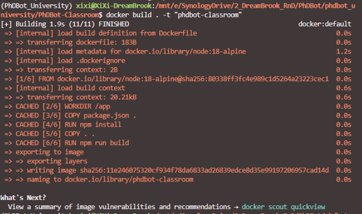
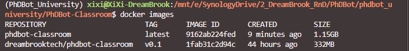
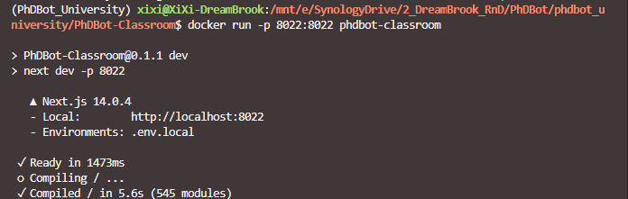
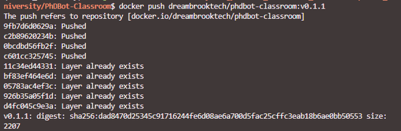

# Deploying a PhDBot Classroom to  Akash Network.

This instruction will be helpful for deploying PhDBot Classroom to Akash Network

## To get started, you'll need:

1. A code editor 
2. Docker Engine installed (you can install it using this [guide](https://docs.docker.com/engine/install/) on the official Docker website). 
3. Registration on [Docker Hub](https://hub.docker.com/)
4. A web wallet installed such as  [Keplr](https://help.keplr.app/articles/installation-guide-for-keplr-extension-for-beginners) or [Leap](https://www.leapwallet.io/support/how-to-set-up-leap-wallet)

## Step 1 - Add a Dockerfile to the root folder of your application.

We first create Dockerfile in the root of the PhDBot Classroom project.

Add the following information to it:

```
FROM node:18-alpine

WORKDIR /app

COPY package.json .

RUN npm install

COPY . .

RUN npm run build

EXPOSE 8022

CMD [ "npm", "run", "dev" ]
```

## Step 2 - Create a Docker container and upload it to Docker Hub.

Now we build the docker for the project

```
docker build . -t "phdbot-classroom"
```



The above command does two things:

- It creates a Docker image from the current context (i.e., from all files and folders in the current directory).
- It gives the image the name "phdbot-classroom".


Now we can check the list of available Docker images on our local system by executing the following command:

```
docker images
```


Great! Now let's try running this image, which now becomes a container. Execute the following command to create a container based on the image named "react-akash-project":

```
docker run -p 8022:8022 phdbot-classroom
```


If everything went well our PhDBot Classroom should be running from the Docker container at [localhost:8022](http://localhost:8080/).

So, the next step is to upload this Docker image to Docker Hub. Before uploading the image to Docker Hub, you need to properly tag it. The command for this looks like this:

```
docker tag image_name username/repository:tag
```

Here's how this command will look in our current case:

```
docker tag react-akash-project dreambrooktech/phdbot-classroom:v0.1
```

To upload the image to Docker Hub, execute the following command:

```
docker push myusername/my_image:latest
```


Now check [Docker Hub](https://hub.docker.com/) to see if your image has appeared. Proceed to the next step.

## Step 3 - Deploying our application on the Akash network.

- Go to the [Cloudmos](https://deploy.cloudmos.io/) website. To deploy your application, you need to have at least 0.5 AKT in your account. Instructions on how to top up your account can be found [here] (https://akash.network/docs/getting-started/token-and-wallets/). Also, during the first login to Cloudmos, create a certificate in the "Settings" section. Click the "Create Certificate" button, confirm all transactions, and the certificate will be ready in a few seconds.


- Create a new deployment, selecting "Hello World", then in the YAML tab, replace the entire content with the following [file](./deploy.yml)


- In this file, update the following fields:

  - Link to your Docker container.
  - Required resources for deployment.


- After making these changes, you need to confirm the initial deposit to start the deployment, which amounts to 0.5 AKT.


- Confirm all necessary steps.


- After a while, you will see a list of providers. Choose the one that best suits your needs, set the appropriate checkbox, and click "ACCEPT BID".


- Then, you confirm everything again.


- After that, go to the EVENTS tab and wait for the appearance of the following text.


- Then you go to the LEASES tab, where you will find a link to your website.


## Congratulations, your application has been successfully deployed on the Akash network!

### Several hacks:

1. If you want to explore the capabilities of the Akash Network but are not yet willing to deposit funds into your account, you can use the sandbox. This is a special environment where you can deploy your application using test tokens. More information about the sandbox can be found [here](https://akash.network/docs/deployments/sandbox/introduction/). The faucet for receiving test tokens is located [here](https://faucet.sandbox-01.aksh.pw/).
2. If you're unfamiliar with using Docker and unsure how to properly create a Dockerfile, you can leverage artificial intelligence tools like ChatGPT, Blackboxа or Copilot. In most cases, though not always on the first attempt, they can help you compose a functional Dockerfile.
3. If you encounter errors when attempting to deploy the app, try closing the deployment first and running it on another provider. If this doesn't resolve the issue, you can always seek assistance from the official Discord channel of Akash Network, where you will definitely be helped.
